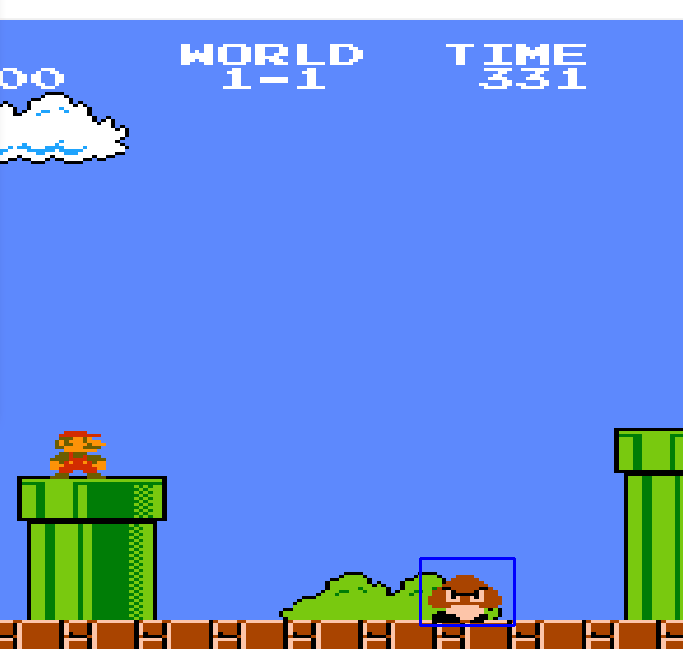

# Advanced Real Time Image Detection Algorithm
## About The Project :mag:
You can run this algorithm to detect and follow the movement of an object. Once you enter the image you want to detect in the code, just drag the window at where you want to detect the image. The algorithm will work better when using 2D images.
## Technologies :rocket:
<ul>
  <li>Python</ li>
</ul>

## Demonstration :gift:

  

